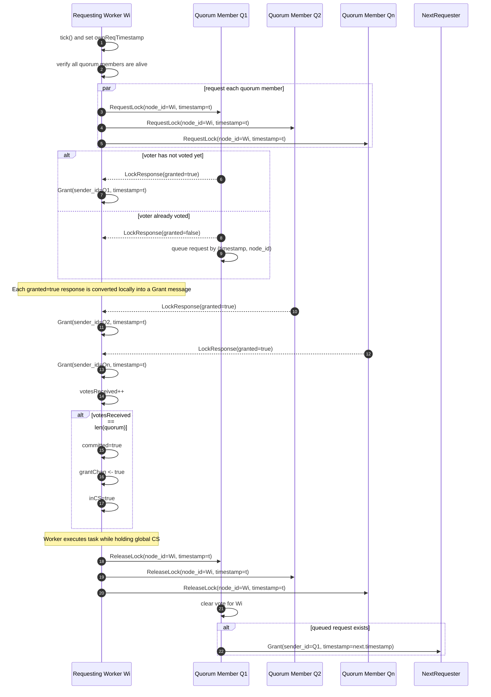
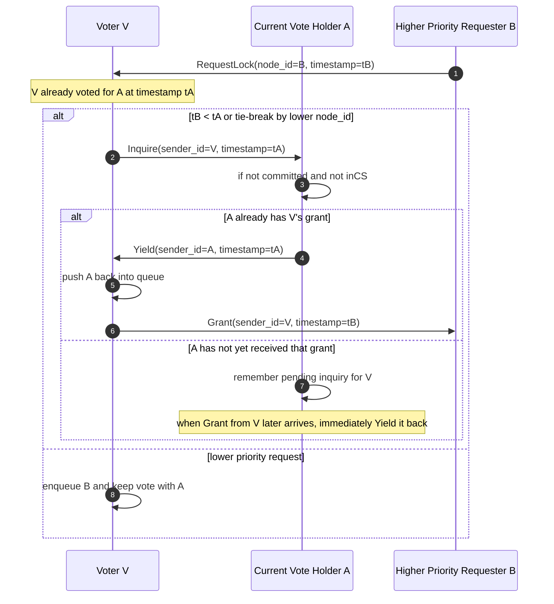
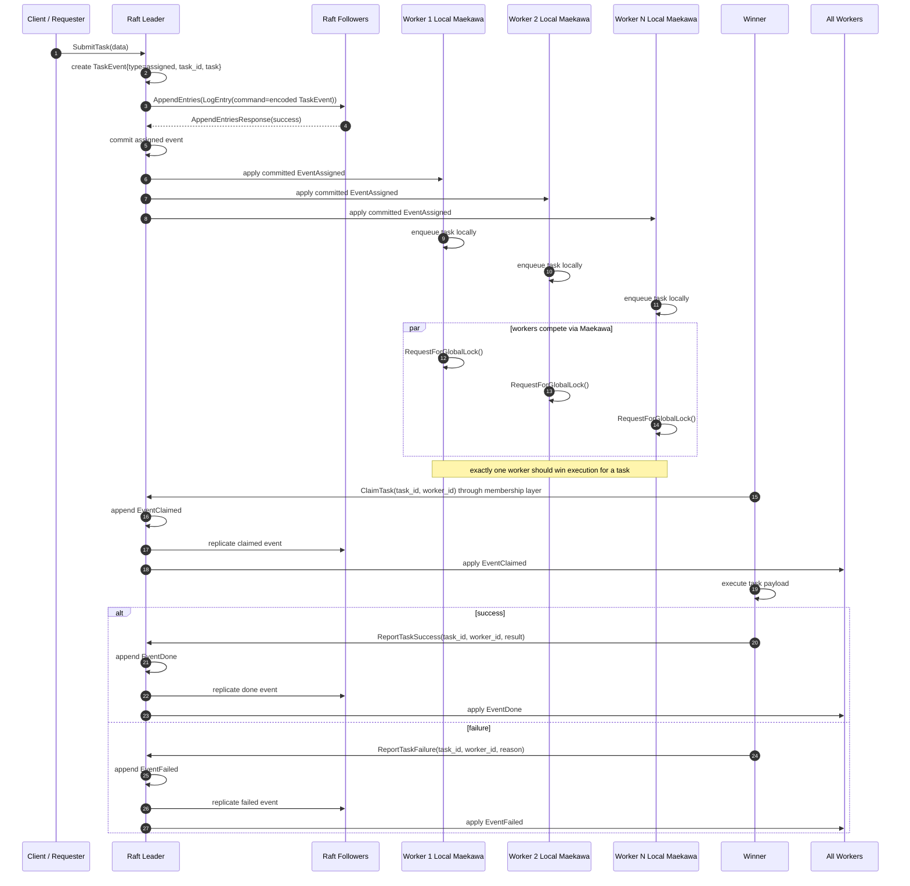

# Maekawa And Raft Interaction Note

This note reflects the current code on `remote-main`.

## 1. What Maekawa Currently Implements

### Roles

- **Requester worker**: the worker trying to enter the global critical section.
- **Voter worker**: each quorum member that can grant at most one vote at a time.
- **Membership source**: an injected interface that answers liveness and records task outcomes.

### Quorum Structure

- Quorums are computed as a row-plus-column grid quorum using [`QuorumFor`](../internal/maekawa/quorum.go).
- On membership change, each worker recomputes its quorum with [`RegridQuorum`](../internal/maekawa/quorum.go) and resets in-flight lock state.

### Maekawa RPC Types

Defined in [`api/maekawa/maekawa.proto`](../api/maekawa/maekawa.proto):

- `RequestLock(LockRequest)`  
  Data: `node_id`, `timestamp`
- `ReleaseLock(ReleaseRequest)`  
  Data: `node_id`, `timestamp`
- `Inquire(InquireRequest)`  
  Data: `sender_id`, `timestamp`
- `Yield(YieldRequest)`  
  Data: `sender_id`, `timestamp`
- `Grant(GrantRequest)`  
  Data: `sender_id`, `timestamp`

### Worker State Used In The Protocol

Important fields in [`internal/maekawa/worker.go`](../internal/maekawa/worker.go):

- `votedFor`, `currentReq`: who this worker currently voted for
- `requestQueue`: queued competing requests ordered by `(timestamp, node_id)`
- `votesReceived`, `grantsReceived`: requester-side vote tracking
- `ownReqTimestamp`: identifies the current lock round
- `committed`, `inCS`: requester-side entry state
- `yieldedTo`, `pendingInquiries`: deadlock-resolution bookkeeping

## 2. Main Maekawa Sequence

This is the actual lock-acquisition path in [`RequestForGlobalLock`](../internal/maekawa/worker.go), [`RequestLock`](../internal/maekawa/worker.go), [`Grant`](../internal/maekawa/worker.go), and [`ReleaseLock`](../internal/maekawa/worker.go).

### What Each Message Means

- `RequestLock`: "Please allocate your single vote to me for lock round `timestamp`."
- `LockResponse(granted=true)`: immediate approval from that quorum member.
- `Grant`: the actual requester-side accounting signal for one received vote.
- `ReleaseLock`: "I am done; you may reassign your vote."

## 3. Deadlock Handling Sequence

This is implemented in [`internal/maekawa/deadlock.go`](../internal/maekawa/deadlock.go).

When a voter already voted for an older request, and a higher-priority request arrives, the voter sends `Inquire` to the current holder. If that holder is still waiting and not yet committed/in CS, it may `Yield`.

### Current Priority Rule

Ordering is by:

1. lower Lamport-style `timestamp`
2. lower `node_id` as tie-break

That ordering is enforced both in the request heap and in the `RequestLock` comparison logic.

## 4. Membership Change Interaction

When the membership layer reports a worker-up or worker-down event, the Maekawa worker calls `OnMembershipChange(...)`.

Effects:

- rebuild `alive` set
- if current vote holder disappeared, evict it and grant the next waiter
- recompute quorum by regridding
- clear vote-tracking state
- abort any in-flight lock acquisition via `grantChan <- false`

That means a membership change is treated as a hard reset for the current lock round.

## 5. Current Raft Integration Boundary

### What Exists

The only real Raft-to-Maekawa bridge on this branch is [`applyTaskEventToMaekawa`](../internal/raft/apply.go), which forwards committed `models.TaskEvent` records into `Worker.ApplyTaskEvent(...)`.

Defined task event types in [`internal/models/task.go`](../internal/models/task.go):

- `assigned`
- `claimed`
- `done`
- `failed`
- `canceled`
- `worker_down`
- `worker_up`
- `worker_removed`
- `worker_added`

### What `ApplyTaskEvent(...)` Currently Does

Current logic in [`internal/maekawa/tasks.go`](../internal/maekawa/tasks.go):

- on `worker_up` or `worker_down`: call `OnMembershipChange(...)`
- on `done` or `canceled`: mark the task as locally canceled so it will be skipped if still queued

### What Is Not Wired Yet

Important gaps on this branch:

- `cmd/worker/main.go` is still a startup stub, so Raft and Maekawa are not actually wired together yet.
- `internal/raft/node.go`, `internal/raft/election.go`, and `internal/raft/ledger.go` are effectively empty.
- `ApplyTaskEvent(...)` does **not** currently handle `assigned`, so committed Raft task assignments are not yet being enqueued into `taskQueue`.
- `ClaimTask`, `ReportTaskSuccess`, and `ReportTaskFailure` are only interface calls from Maekawa into the membership layer; there is no concrete Raft-backed implementation yet in this branch.

## 6. Intended End-To-End Raft + Maekawa Flow

This is the intended architecture implied by the interfaces and event types, even though the full Raft side is not implemented yet.

## 7. What The Raft Leader Needs To Do

Given the current Maekawa structure, the Raft leader should own the following responsibilities.

### Task Intake And Ordering

- Accept `SubmitTask(data)` requests.
- Generate a globally unique `task_id`.
- Append an `EventAssigned` log entry carrying the task payload.
- Replicate it with `AppendEntries`.
- Only expose the task to workers after the assignment entry is committed.

### Membership As Source Of Truth

- Maintain the authoritative list of active workers.
- Commit `worker_up`, `worker_down`, `worker_added`, and `worker_removed` events.
- On apply, deliver those committed events to each local Maekawa worker so it can regrid quorum membership.

### Backing The `ClusterMembership` Interface

The leader-backed Raft layer needs a concrete implementation of:

- `ActiveMembers() []int32`
- `IsAlive(id int32) bool`
- `ClaimTask(taskID, workerID)`
- `ReportTaskSuccess(taskID, workerID, result)`
- `ReportTaskFailure(taskID, workerID, reason)`

Semantically:

- `ClaimTask(...)` must be linearized through Raft so only one worker becomes the official winner for a task.
- `ReportTaskSuccess(...)` must turn into a committed `done` event.
- `ReportTaskFailure(...)` must turn into a committed `failed` event.

### Apply Path Duties

- Decode committed log entries into `models.TaskEvent`.
- Call `applyTaskEventToMaekawa(...)` only after commit.
- Extend `Worker.ApplyTaskEvent(...)` to handle `EventAssigned` by pushing the task into `taskQueue`.
- Decide what `EventClaimed` should do locally, for example mark non-winning workers to stop retrying that task.

### Safety Guarantees The Leader Must Preserve

- Maekawa only gives temporary permission to execute; Raft must still be the final source of truth for task ownership and completion.
- A worker should never be treated as the winner just because it entered the Maekawa critical section.
- The official winner is the worker whose `ClaimTask` is accepted and committed by Raft.
- Completion or failure must only become externally visible after the corresponding Raft log entry is committed.

### Recovery And Failure Handling

- If a worker dies before claiming, Raft should eventually commit a membership event and let Maekawa regrid.
- If a worker dies after entering CS but before reporting success/failure, the leader needs a recovery policy:
  - requeue the task, or
  - mark it failed, or
  - wait for lease/timeout expiry before reassignment
- If leadership changes, the new leader must reconstruct pending tasks and worker membership from the committed log.

## 8. Practical Summary

Right now:

- Maekawa mutual exclusion and deadlock-resolution messaging are mostly implemented.
- Raft is only represented by protobufs plus a tiny committed-event callback.
- The real missing bridge is: committed `assigned/claimed/done/failed/membership` events need to drive the Maekawa worker queue and membership view.

If you want, the next step can be to turn this note into a shorter report-ready diagram set, or I can start wiring the missing `EventAssigned -> taskQueue` and Raft-backed `ClusterMembership` skeleton.
