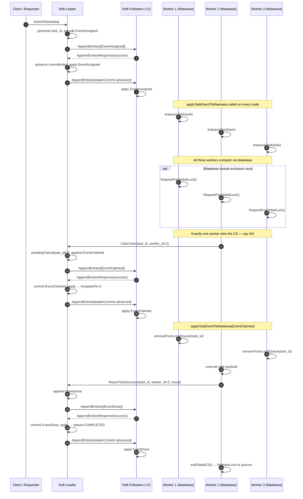
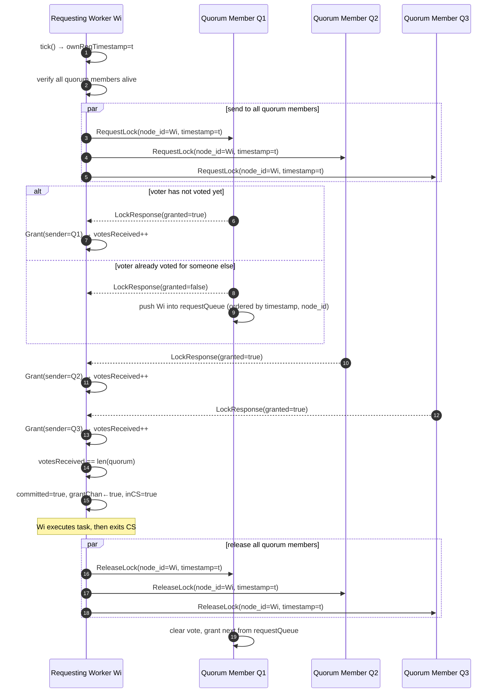
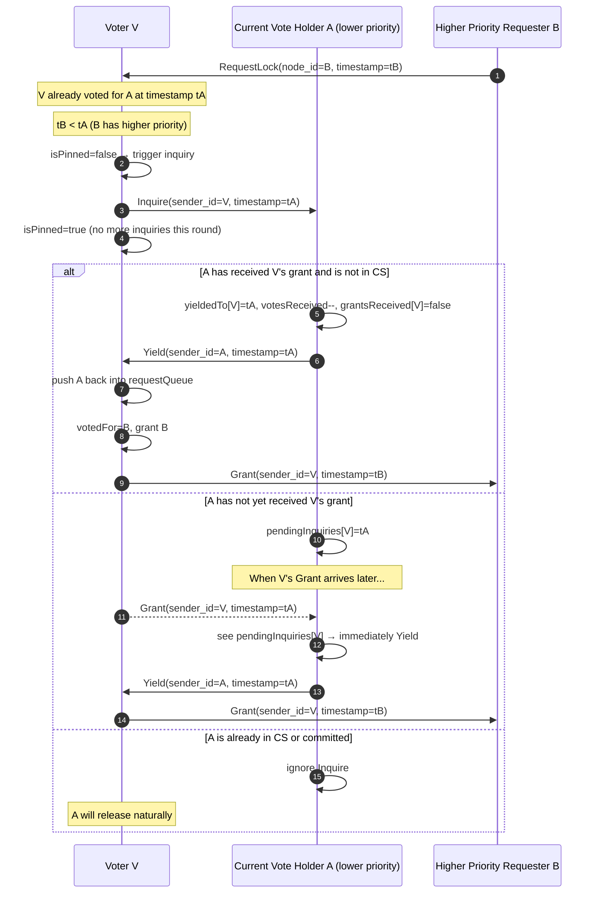
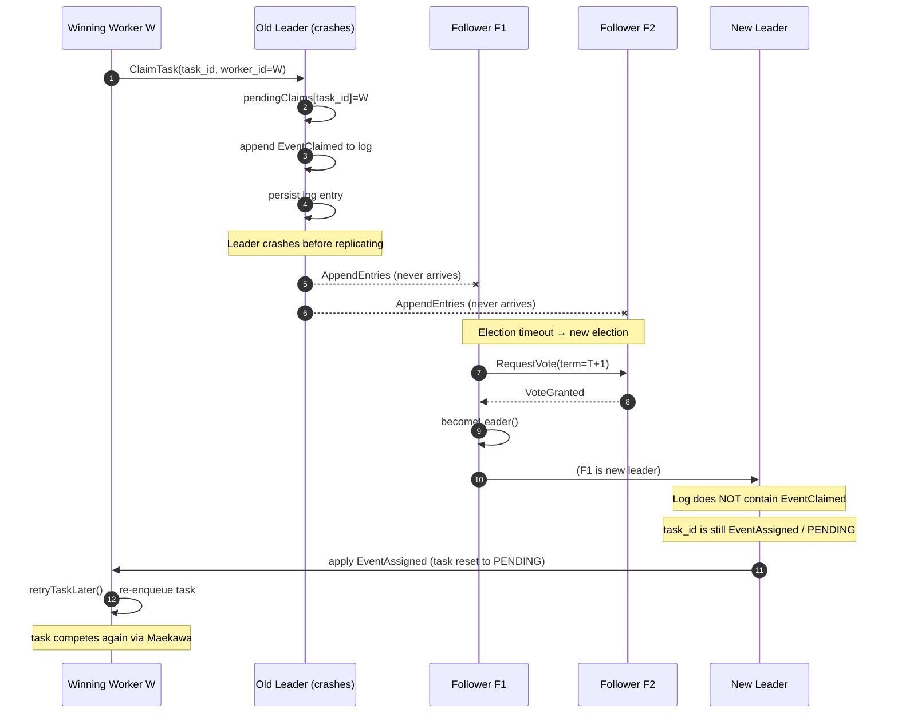
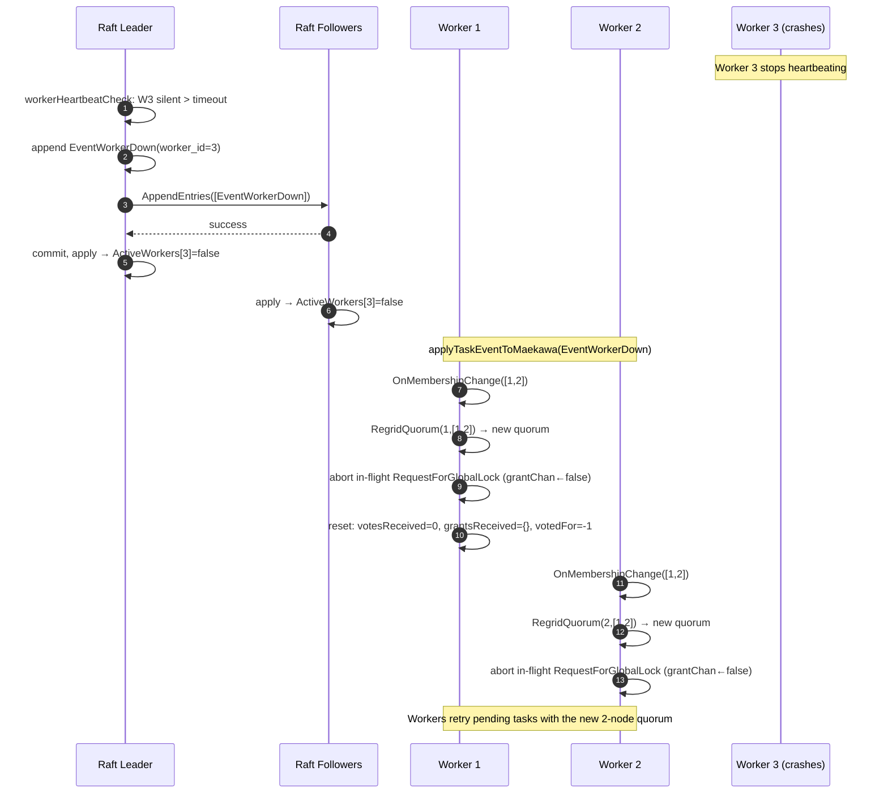
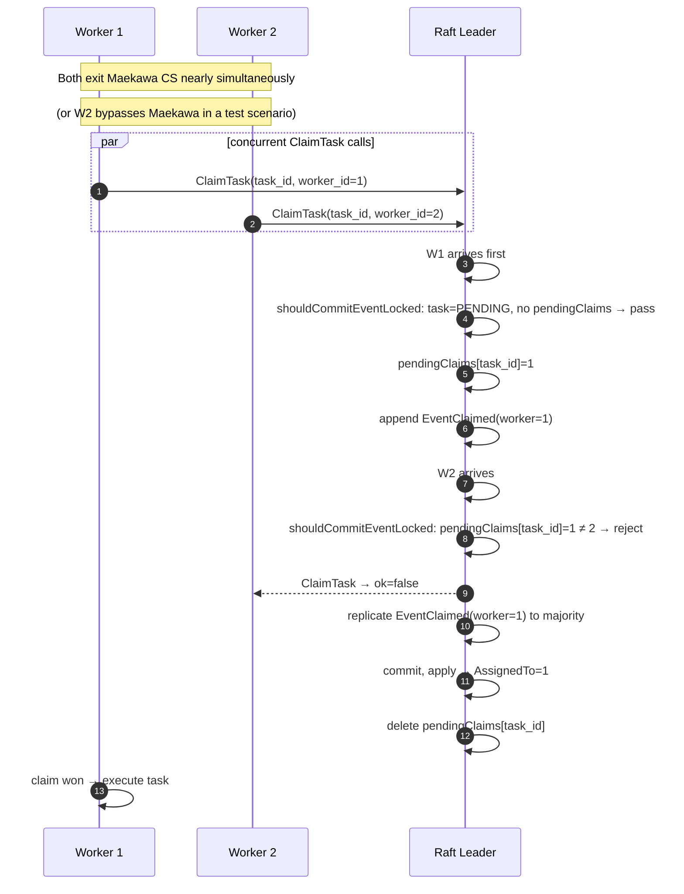

# Maekawa + Raft: Interaction and End-to-End Sequence

This document reflects the **fully implemented** system on the `raft-maekawa` branch.

---

## System Overview

The system combines two algorithms to achieve safe, exactly-once distributed task execution:

- **Raft** is the source of truth. It decides what tasks exist, which worker officially owns each task, and what the final result is. Nothing is externally visible until Raft commits it.
- **Maekawa** is the race resolver. When multiple workers all see a pending task, Maekawa's quorum-based mutex ensures at most one enters the critical section at a time and calls `ClaimTask`. Raft then makes that claim official.

Neither layer is sufficient alone:
- Raft alone would require a central lock or a compare-and-swap loop to break ties between concurrent claims.
- Maekawa alone has no persistent log, so a worker crash can lose task assignment state.

Together: Maekawa ensures only one worker reaches `ClaimTask` at a time; Raft serializes that claim into the replicated log so every node agrees on the winner.

---

## 1. Full Runtime Flow

This is the implementation-level happy path plus the two main recovery branches. It reflects the actual split in this repo:

- task existence and status changes are committed through Raft
- lock competition happens directly between Maekawa workers
- worker liveness comes from `WorkerHeartbeat` to the Raft leader
- membership changes trigger `OnMembershipChange(...)` and local quorum regridding on every worker

```mermaid
sequenceDiagram
    autonumber
    participant C as Client
    participant RL as Raft Leader
    participant RF1 as Raft Follower 1
    participant RF2 as Raft Follower 2
    participant W1 as Worker 1
    participant W2 as Worker 2
    participant W3 as Worker 3

    Note over W1,W3: Background liveness path
    loop every ~100 ms
        W1->>RL: WorkerHeartbeat(1)
        W2->>RL: WorkerHeartbeat(2)
        W3->>RL: WorkerHeartbeat(3)
        RL-->>W1: success, leaderId
        RL-->>W2: success, leaderId
        RL-->>W3: success, leaderId
    end

    Note over C,RF2: Task creation in Raft
    C->>RL: SubmitTask(data)
    RL->>RL: generate task_id
    RL->>RL: encode EventAssigned(task_id, data)
    RL->>RL: append EventAssigned to local log
    RL->>RF1: AppendEntries([EventAssigned])
    RL->>RF2: AppendEntries([EventAssigned])
    RF1-->>RL: AppendEntriesResponse(success)
    RF2-->>RL: AppendEntriesResponse(success)
    RL->>RL: majority reached -> advance commitIndex
    RL->>RL: apply EventAssigned -> task status=PENDING
    RL->>RF1: AppendEntries(leaderCommit advanced)
    RL->>RF2: AppendEntries(leaderCommit advanced)
    RF1->>RF1: apply EventAssigned -> task status=PENDING
    RF2->>RF2: apply EventAssigned -> task status=PENDING
    RL-->>C: SubmitTaskResponse(success=true, task_id)

    Note over RL,W3: Committed task delivery to workers
    par in-process test path
        RL->>W1: applyTaskEventToMaekawa(EventAssigned)
        RL->>W2: applyTaskEventToMaekawa(EventAssigned)
        RL->>W3: applyTaskEventToMaekawa(EventAssigned)
    and production path
        W1->>RL: GetState / snapshot sync
        W2->>RL: GetState / snapshot sync
        W3->>RL: GetState / snapshot sync
        RL-->>W1: task task_id is PENDING
        RL-->>W2: task task_id is PENDING
        RL-->>W3: task task_id is PENDING
    end

    W1->>W1: ApplyTaskEvent(EventAssigned) -> enqueueTask(task)
    W2->>W2: ApplyTaskEvent(EventAssigned) -> enqueueTask(task)
    W3->>W3: ApplyTaskEvent(EventAssigned) -> enqueueTask(task)

    Note over W1,W3: Workers independently pop local queue copies and compete
    par W1 lock round
        W1->>W1: RunTaskLoop -> RequestForGlobalLock()
        W1->>W1: tick() -> ownReqTimestamp=t1
        W1->>W1: verify quorum members are IsAlive
        W1->>W1: RequestLock(self, t1)
        W1->>W2: RequestLock(W1, t1)
        W1->>W3: RequestLock(W1, t1)
    and W2 lock round
        W2->>W2: RunTaskLoop -> RequestForGlobalLock()
        W2->>W2: tick() -> ownReqTimestamp=t2
        W2->>W2: verify quorum members are IsAlive
        W2->>W1: RequestLock(W2, t2)
        W2->>W2: RequestLock(self, t2)
        W2->>W3: RequestLock(W2, t2)
    and W3 lock round
        W3->>W3: RunTaskLoop -> RequestForGlobalLock()
        W3->>W3: tick() -> ownReqTimestamp=t3
        W3->>W3: verify quorum members are IsAlive
        W3->>W1: RequestLock(W3, t3)
        W3->>W2: RequestLock(W3, t3)
        W3->>W3: RequestLock(self, t3)
    end

    Note over W1,W3: Voters either grant immediately, or queue requests and may use INQUIRE/YIELD
    W1-->>W2: Grant / deny according to timestamp ordering
    W2-->>W1: Grant / deny according to timestamp ordering
    W3-->>W1: Grant / deny according to timestamp ordering
    W1-->>W3: Grant / deny according to timestamp ordering
    W2-->>W3: Grant / deny according to timestamp ordering
    W3-->>W2: Grant / deny according to timestamp ordering

    Note over W1,W3: Assume W2 wins the Maekawa round
    W2->>W2: grantChan <- true -> inCS=true

    Note over W2,RF2: Ownership is still not official until Raft commits ClaimTask
    W2->>RL: ClaimTask(task_id, worker_id=2)
    RL->>RL: shouldCommitEventLocked(task is PENDING)
    RL->>RL: pendingClaims[task_id]=2
    RL->>RL: append EventClaimed(worker=2)
    RL->>RF1: AppendEntries([EventClaimed])
    RL->>RF2: AppendEntries([EventClaimed])
    RF1-->>RL: AppendEntriesResponse(success)
    RF2-->>RL: AppendEntriesResponse(success)
    RL->>RL: majority reached -> commit EventClaimed
    RL->>RL: apply EventClaimed -> status=IN_PROGRESS, AssignedTo=2
    RL->>RF1: AppendEntries(leaderCommit advanced)
    RL->>RF2: AppendEntries(leaderCommit advanced)
    RF1->>RF1: apply EventClaimed
    RF2->>RF2: apply EventClaimed
    RL-->>W2: ClaimTask ok=true

    Note over RL,W3: Committed claim is delivered to workers
    RL->>W1: apply/snapshot => EventClaimed(worker=2)
    RL->>W2: apply/snapshot => EventClaimed(worker=2)
    RL->>W3: apply/snapshot => EventClaimed(worker=2)
    W1->>W1: removeFromLocalQueue(task_id)
    W3->>W3: removeFromLocalQueue(task_id)

    W2->>W2: execute task payload

    alt task execution succeeds
        W2->>RL: ReportTaskSuccess(task_id, worker_id=2, result)
        RL->>RL: append EventDone
        RL->>RF1: AppendEntries([EventDone])
        RL->>RF2: AppendEntries([EventDone])
        RF1-->>RL: AppendEntriesResponse(success)
        RF2-->>RL: AppendEntriesResponse(success)
        RL->>RL: commit EventDone -> status=COMPLETED
        RL->>RF1: AppendEntries(leaderCommit advanced)
        RL->>RF2: AppendEntries(leaderCommit advanced)
        RF1->>RF1: apply EventDone
        RF2->>RF2: apply EventDone
    else task execution fails
        W2->>RL: ReportTaskFailure(task_id, worker_id=2, reason)
        RL->>RL: append EventFailed
        RL->>RF1: AppendEntries([EventFailed])
        RL->>RF2: AppendEntries([EventFailed])
        RF1-->>RL: AppendEntriesResponse(success)
        RF2-->>RL: AppendEntriesResponse(success)
        RL->>RL: commit EventFailed -> status=FAILED
        RL->>RF1: AppendEntries(leaderCommit advanced)
        RL->>RF2: AppendEntries(leaderCommit advanced)
        RF1->>RF1: apply EventFailed
        RF2->>RF2: apply EventFailed
    end

    W2->>W2: exitGlobalCS()
    W2->>W1: ReleaseLock(W2, t2)
    W2->>W2: ReleaseLock(self, t2)
    W2->>W3: ReleaseLock(W2, t2)

    opt quorum member dies while a worker is waiting for grants
        Note over RL,W3: Liveness is authoritative only after Raft leader times out heartbeats
        RL->>RL: workerHeartbeatCheck -> W3 silent > timeout
        RL->>RL: append EventWorkerDown(3)
        RL->>RF1: AppendEntries([EventWorkerDown])
        RL->>RF2: AppendEntries([EventWorkerDown])
        RF1-->>RL: success
        RF2-->>RL: success
        RL->>RL: commit EventWorkerDown -> ActiveWorkers[3]=false
        RL->>W1: apply/snapshot => EventWorkerDown(3)
        RL->>W2: apply/snapshot => EventWorkerDown(3)
        W1->>W1: OnMembershipChange([1,2]) -> RegridQuorum(...)
        W2->>W2: OnMembershipChange([1,2]) -> RegridQuorum(...)
        W1->>W1: abort in-flight RequestForGlobalLock (grantChan <- false)
        W2->>W2: abort in-flight RequestForGlobalLock (grantChan <- false)
        W1->>W1: clear lock-round state
        W2->>W2: clear lock-round state
        W1->>W1: retryTaskLater(task) -> enqueueTask(task)
        W2->>W2: retryTaskLater(task) -> enqueueTask(task)
    end

    opt worker dies after claim committed but before done/failed is reported
        Note over W2,RL: Task is already official IN_PROGRESS in Raft
        W2--xRL: no more WorkerHeartbeat(2)
        RL->>RL: workerHeartbeatCheck -> W2 silent > timeout
        RL->>RL: commit EventWorkerDown(2)
        RL->>RL: runTaskRecoveryLoop()
        RL->>RL: task task_id is IN_PROGRESS, AssignedTo=2, timeout elapsed
        RL->>RL: append fresh EventAssigned(task_id, original data)
        RL->>RF1: AppendEntries([EventAssigned recovery])
        RL->>RF2: AppendEntries([EventAssigned recovery])
        RF1-->>RL: success
        RF2-->>RL: success
        RL->>RL: commit recovery EventAssigned -> status=PENDING, AssignedTo=0
        RL->>W1: apply/snapshot => EventAssigned(task_id)
        RL->>W3: apply/snapshot => EventAssigned(task_id)
        W1->>W1: enqueueTask(task)
        W3->>W3: enqueueTask(task)
        Note over W1,W3: Surviving workers compete again via Maekawa
    end
```

---

## 2. End-to-End Task Flow

```mermaid
sequenceDiagram
    autonumber
    participant C  as Client / Requester
    participant RL as Raft Leader
    participant RF as Raft Followers (×2)
    participant W1 as Worker 1 (Maekawa)
    participant W2 as Worker 2 (Maekawa)
    participant W3 as Worker 3 (Maekawa)

    C->>RL: SubmitTask(data)
    RL->>RL: generate task_id, encode EventAssigned
    RL->>RF: AppendEntries([EventAssigned])
    RF-->>RL: AppendEntriesResponse(success)
    RL->>RL: advance commitIndex, apply EventAssigned
    RL->>RF: AppendEntries(leaderCommit advanced)
    RF->>RF: apply EventAssigned

    Note over W1,W3: applyTaskEventToMaekawa called on every node

    W1->>W1: enqueueTask(task)
    W2->>W2: enqueueTask(task)
    W3->>W3: enqueueTask(task)

    Note over W1,W3: All three workers compete via Maekawa

    par Maekawa mutual exclusion race
        W1->>W1: RequestForGlobalLock()
        W2->>W2: RequestForGlobalLock()
        W3->>W3: RequestForGlobalLock()
    end

    Note over W1,W3: Exactly one worker wins the CS — say W2

    W2->>RL: ClaimTask(task_id, worker_id=2)
    RL->>RL: pendingClaims[task_id]=2, append EventClaimed
    RL->>RF: AppendEntries([EventClaimed])
    RF-->>RL: AppendEntriesResponse(success)
    RL->>RL: commit EventClaimed, apply → AssignedTo=2
    RL->>RF: AppendEntries(leaderCommit advanced)
    RF->>RF: apply EventClaimed

    Note over W1,W3: applyTaskEventToMaekawa(EventClaimed)
    W1->>W1: removeFromLocalQueue(task_id)
    W3->>W3: removeFromLocalQueue(task_id)

    W2->>W2: execute task payload
    W2->>RL: ReportTaskSuccess(task_id, worker_id=2, result)
    RL->>RL: append EventDone
    RL->>RF: AppendEntries([EventDone])
    RF-->>RL: AppendEntriesResponse(success)
    RL->>RL: commit EventDone, apply → status=COMPLETED
    RL->>RF: AppendEntries(leaderCommit advanced)
    RF->>RF: apply EventDone

    W2->>W2: exitGlobalCS() → ReleaseLock to quorum
```

---

## 3. Maekawa Lock Acquisition Detail

```mermaid
sequenceDiagram
    autonumber
    participant Wi as Requesting Worker Wi
    participant Q1 as Quorum Member Q1
    participant Q2 as Quorum Member Q2
    participant Q3 as Quorum Member Q3

    Wi->>Wi: tick() → ownReqTimestamp=t
    Wi->>Wi: verify all quorum members alive

    par send to all quorum members
        Wi->>Q1: RequestLock(node_id=Wi, timestamp=t)
        Wi->>Q2: RequestLock(node_id=Wi, timestamp=t)
        Wi->>Q3: RequestLock(node_id=Wi, timestamp=t)
    end

    alt voter has not voted yet
        Q1-->>Wi: LockResponse(granted=true)
        Wi->>Wi: Grant(sender=Q1) → votesReceived++
    else voter already voted for someone else
        Q1-->>Wi: LockResponse(granted=false)
        Q1->>Q1: push Wi into requestQueue (ordered by timestamp, node_id)
    end

    Q2-->>Wi: LockResponse(granted=true)
    Wi->>Wi: Grant(sender=Q2) → votesReceived++

    Q3-->>Wi: LockResponse(granted=true)
    Wi->>Wi: Grant(sender=Q3) → votesReceived++

    Wi->>Wi: votesReceived == len(quorum)
    Wi->>Wi: committed=true, grantChan←true, inCS=true

    Note over Wi: Wi executes task, then exits CS

    par release all quorum members
        Wi->>Q1: ReleaseLock(node_id=Wi, timestamp=t)
        Wi->>Q2: ReleaseLock(node_id=Wi, timestamp=t)
        Wi->>Q3: ReleaseLock(node_id=Wi, timestamp=t)
    end

    Q1->>Q1: clear vote, grant next from requestQueue
```

---

## 4. Deadlock Prevention: INQUIRE / YIELD

Deadlock arises when two workers hold each other's needed votes and neither can proceed. The INQUIRE/YIELD protocol breaks this without a coordinator.

```mermaid
sequenceDiagram
    autonumber
    participant V  as Voter V
    participant A  as Current Vote Holder A (lower priority)
    participant B  as Higher Priority Requester B

    B->>V: RequestLock(node_id=B, timestamp=tB)
    Note over V: V already voted for A at timestamp tA
    Note over V: tB < tA (B has higher priority)

    V->>V: isPinned=false → trigger inquiry
    V->>A: Inquire(sender_id=V, timestamp=tA)
    V->>V: isPinned=true (no more inquiries this round)

    alt A has received V's grant and is not in CS
        A->>A: yieldedTo[V]=tA, votesReceived--, grantsReceived[V]=false
        A->>V: Yield(sender_id=A, timestamp=tA)
        V->>V: push A back into requestQueue
        V->>V: votedFor=B, grant B
        V->>B: Grant(sender_id=V, timestamp=tB)
    else A has not yet received V's grant
        A->>A: pendingInquiries[V]=tA
        Note over A: When V's Grant arrives later...
        V-->>A: Grant(sender_id=V, timestamp=tA)
        A->>A: see pendingInquiries[V] → immediately Yield
        A->>V: Yield(sender_id=A, timestamp=tA)
        V->>B: Grant(sender_id=V, timestamp=tB)
    else A is already in CS or committed
        A->>A: ignore Inquire
        Note over V: A will release naturally
    end
```

Priority rule: lower Lamport timestamp wins; ties broken by lower node ID.

---

## 5. Leader Crash After Claim, Before Commit

This is the hardest failure scenario. The `pendingClaims` guard and Raft log durability together ensure safety.

```mermaid
sequenceDiagram
    autonumber
    participant W  as Winning Worker W
    participant L  as Old Leader (crashes)
    participant F1 as Follower F1
    participant F2 as Follower F2
    participant NL as New Leader

    W->>L: ClaimTask(task_id, worker_id=W)
    L->>L: pendingClaims[task_id]=W
    L->>L: append EventClaimed to log
    L->>L: persist log entry

    Note over L: Leader crashes before replicating

    L--xF1: AppendEntries (never arrives)
    L--xF2: AppendEntries (never arrives)

    Note over F1,F2: Election timeout → new election

    F1->>F2: RequestVote(term=T+1)
    F2-->>F1: VoteGranted
    F1->>F1: becomeLeader()
    F1->>NL: (F1 is new leader)

    Note over NL: Log does NOT contain EventClaimed
    Note over NL: task_id is still EventAssigned / PENDING

    NL->>W: apply EventAssigned (task reset to PENDING)
    W->>W: retryTaskLater() → re-enqueue task
    Note over W: task competes again via Maekawa
```

Key invariant: the claim entry was never replicated to a majority, so it is not in any follower's log. The new leader's state correctly shows the task as PENDING. The old entry in the crashed leader's log is overwritten when it rejoins as a follower.

---

## 6. Membership Change and Quorum Regrid

```mermaid
sequenceDiagram
    autonumber
    participant RL as Raft Leader
    participant RF as Raft Followers
    participant W1 as Worker 1
    participant W2 as Worker 2
    participant W3 as Worker 3 (crashes)

    Note over W3: Worker 3 stops heartbeating

    RL->>RL: workerHeartbeatCheck: W3 silent > timeout
    RL->>RL: append EventWorkerDown(worker_id=3)
    RL->>RF: AppendEntries([EventWorkerDown])
    RF-->>RL: success
    RL->>RL: commit, apply → ActiveWorkers[3]=false
    RF->>RF: apply → ActiveWorkers[3]=false

    Note over W1,W2: applyTaskEventToMaekawa(EventWorkerDown)

    W1->>W1: OnMembershipChange([1,2])
    W1->>W1: RegridQuorum(1,[1,2]) → new quorum
    W1->>W1: abort in-flight RequestForGlobalLock (grantChan←false)
    W1->>W1: reset: votesReceived=0, grantsReceived={}, votedFor=-1

    W2->>W2: OnMembershipChange([1,2])
    W2->>W2: RegridQuorum(2,[1,2]) → new quorum
    W2->>W2: abort in-flight RequestForGlobalLock (grantChan←false)

    Note over W1,W2: Workers retry pending tasks with the new 2-node quorum
```

---

## 7. Concurrent Claims Race (Claim Guard)

```mermaid
sequenceDiagram
    autonumber
    participant W1 as Worker 1
    participant W2 as Worker 2
    participant RL as Raft Leader

    Note over W1,W2: Both exit Maekawa CS nearly simultaneously
    Note over W1,W2: (or W2 bypasses Maekawa in a test scenario)

    par concurrent ClaimTask calls
        W1->>RL: ClaimTask(task_id, worker_id=1)
        W2->>RL: ClaimTask(task_id, worker_id=2)
    end

    RL->>RL: W1 arrives first
    RL->>RL: shouldCommitEventLocked: task=PENDING, no pendingClaims → pass
    RL->>RL: pendingClaims[task_id]=1
    RL->>RL: append EventClaimed(worker=1)

    RL->>RL: W2 arrives
    RL->>RL: shouldCommitEventLocked: pendingClaims[task_id]=1 ≠ 2 → reject
    RL-->>W2: ClaimTask → ok=false

    RL->>RL: replicate EventClaimed(worker=1) to majority
    RL->>RL: commit, apply → AssignedTo=1
    RL->>RL: delete pendingClaims[task_id]

    W1->>W1: claim won → execute task
```
